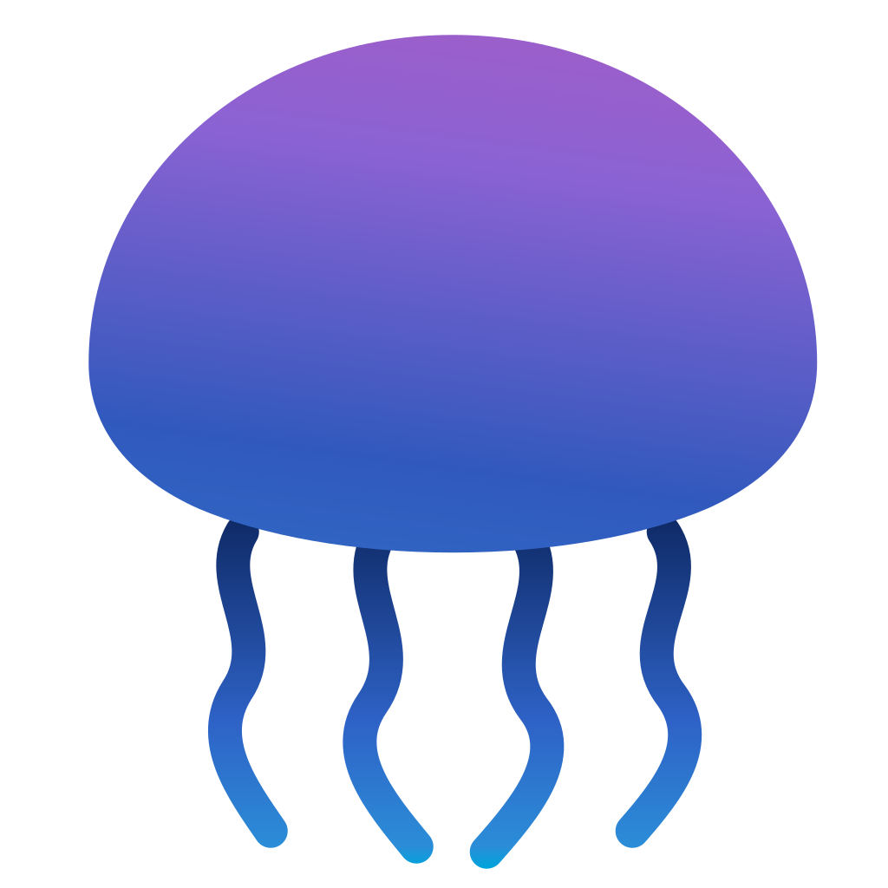

<!-- markdownlint-disable MD033 -->

 
 <h1 align="center">atolla</h1>

  <em>beautiful Jellyfin music player for android and ios with an offline first playback experience</em>

## Features

* Gapless playback
* Seamless online/offline switching (including offline search & scrobbling)
* Image focussed UI (featuring artist logos)
* Dynamic colour palettes generated from album artwork
* Local waveform generation for fancy progress bars
* Playlist creation & editing

## Screenshots

### player

 
 

* Color palettes generated from album art.
* Track waveform progress bar
* Artist logo front and center

### home tab

 
 

* Albums release on this day
* Recently added
* Recently played
* Various mixes

### artist view

 
 

### library & album view

 
 

* Floating player progress bar

### search & genre list

 
 

* Search that works online and offline
* Genre playlists that work online and offline
* Genre pills on artists and albums online and offline

## Why?

I switched from Plex to Jellyfin several years ago, but could never find a
Jellyfin music player as good as Plexamp. Findroid is great, it's got a more
comprehensive feature set that atolla, and they're making good progress with
the UI rework, but it's just not what I want out of a music player.
So I built my own one. This is the music app I want to use.

However, there are a few things I'd like to stress that this app isn't:

**It's not a comprehensive Jellyfin music management solution**
The focus is on the listening experience not managing the data on your server.
There will also be some functionality that's available in Jellyfin but not in
the app as it's not a good fit, and that's fine.

**It's not a feature compatible alternative to Plexamp.**
I'm not trying to build "Plexamp for Jellyfin", I'm trying to build a great
music player for Jellyfin, so there will be some things that Plexamp does that
atolla doesn't, and some things atolla does that Plexamp doesn't.

**It's not a fully customisable 'make it your own' app.**
The design is intentionally opinionated, it won't try to give you all of the
customisation options you want to configure things, that makes it a lot harder
to maintain. Suggestions for improvements or things that could be editable are
always welcomed, but they might not be actioned.

## Installing

TBD

> [!WARNING] the iOS app is in beta
>
> It has been tested a lot in an emulator, but I don't have an iPhone, so can't test
> it on device.
> As such I can't gurantee it will work as well as the Android version which I have
> been using daily for weeks.
>
> If you run into issues please raise them. If you can create a PR to fix the
> issues and test it out on your own device, even better.

## Feature Requests

Got something you'd like to see?

Create an issue and label it as 'feature request'.

## Contributing

See CONTRIBUTING.md for details on building and developing.
